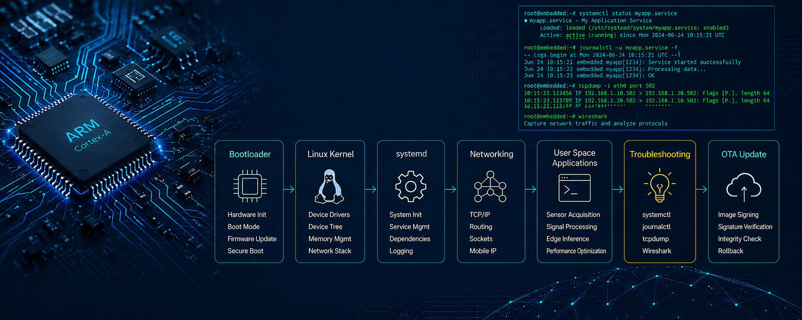

# Hi, I'm Qing Zhou 👋

**Embedded Linux Software Engineer**

Embedded Linux | Embedded C/C++ | Yocto | Bootloader | OTA | ARM | Networking

  

---

## About Me

I am an Embedded Linux Software Engineer with experience in networking software, embedded firmware, and ARM-based Linux platforms. My work spans the complete software lifecycle, from hardware bring-up and firmware development to Linux integration, OTA updates, and system-level debugging.

My background includes:

- Embedded Linux application development
- Embedded C/C++ on ARM platforms
- Yocto-based Linux integration
- Bootloader and firmware development
- OTA firmware update and verification
- Secure firmware signing and validation
- Linux system integration with systemd
- TCP/IP networking and communication protocols
- Hardware bring-up and debugging

Previously, I worked at Huawei Technologies, developing networking software and communication protocols for carrier-grade systems. Most recently, at Teraki, I focused on Embedded Linux software, firmware integration, OTA update workflows, and ARM-based embedded platforms.

I enjoy building hands-on projects in Embedded Linux, firmware, networking, and Edge AI for embedded systems.

---

## Technical Skills

### Embedded Linux

- Yocto
- Buildroot
- systemd
- Device Tree
- Boot Process
- Cross Compilation

### Embedded Software

- Embedded C
- Modern C++
- ARM Platforms
- Firmware Development
- Hardware Bring-up
- Debugging

### Firmware & Security

- Secure Boot
- Firmware Signing
- Signature Verification
- Integrity Validation
- SHA256
- OTA Update
- Rollback Protection

### Networking

- TCP/IP
- Socket Programming
- Routing
- Mobile IP
- Communication Protocols

### Development Tools

- Git
- CMake
- Makefile
- OpenSSL
- Docker
- Linux

---

# Featured Projects

## Embedded Firmware Verification

Firmware signing and verification framework for Embedded Linux devices.

Highlights

- RSA signature verification
- SHA256 integrity validation
- Secure firmware update workflow
- Rollback protection
- OpenSSL implementation

Technologies

`C` `OpenSSL` `Embedded Linux`

---

## Yocto TCP Server

Simple TCP server integrated into a Yocto-based Linux image.

Highlights

- Custom BitBake recipe
- Cross compilation
- Deployment on Raspberry Pi
- systemd service integration

Technologies

`Yocto` `BitBake` `Linux`

---

## Edge AI Contact Detection

Audio-based anomaly detection running on embedded ARM platforms.

Highlights

- Log-Mel feature extraction
- TinyML inference
- Embedded deployment 
- Performance optimization

Technologies

`C++` `Python` `TensorFlow Lite`

---

## Areas of Interest

- Embedded Linux
- Embedded C/C++
- Firmware Development
- Linux Platform Integration
- Yocto
- Secure Boot
- OTA
- Automotive Embedded Systems

---

## Connect with Me

- LinkedIn: https://www.linkedin.com/in/qing-zhou-692215b